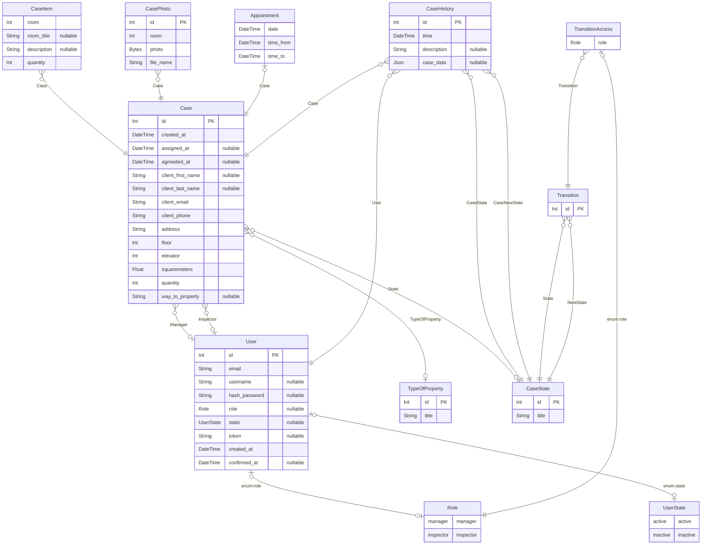

```mermaid
erDiagram

        Role {
            manager manager
inspector inspector
        }
    


        UserState {
            active active
inactive inactive
        }
    
  User {
    Int id PK 
    String email  
    String username  "nullable"
    String hash_password  "nullable"
    Role role  "nullable"
    UserState state  "nullable"
    String token  "nullable"
    DateTime created_at  
    DateTime confirmed_at  "nullable"
    }
  

  Case {
    Int id PK 
    DateTime created_at  
    DateTime assigned_at  "nullable"
    DateTime agreeded_at  "nullable"
    String client_first_name  "nullable"
    String client_last_name  "nullable"
    String client_email  
    String client_phone  
    String address  
    Int floor  
    Int elevator  
    Float squaremeters  
    Int quantity  
    String way_to_property  "nullable"
    }
  

  TypeOfProperty {
    Int id PK 
    String title  
    }
  

  CaseState {
    Int id PK 
    String title  
    }
  

  CaseItem {
    Int room  
    String room_title  "nullable"
    String description  "nullable"
    Int quantity  
    }
  

  CasePhoto {
    Int id PK 
    Int room  
    Bytes photo  
    String file_name  
    }
  

  Appointment {
    DateTime date  
    DateTime time_from  
    DateTime time_to  
    }
  

  CaseHistory {
    Int id PK 
    DateTime time  
    String description  "nullable"
    Json case_data  "nullable"
    }
  

  Transition {
    Int id PK 
    }
  

  TransitionAccess {
    Role role  
    }
  
    User o|--|o Role : "enum:role"
    User o|--|o UserState : "enum:state"
    Case o{--|o TypeOfProperty : "TypeOfProperty"
    Case o{--|o CaseState : "State"
    Case o{--|o User : "Manager"
    Case o{--|o User : "Inspector"
    CaseItem o{--|| Case : "Case"
    CasePhoto o{--|| Case : "Case"
    Appointment o|--|| Case : "Case"
    CaseHistory o{--|| Case : "Case"
    CaseHistory o{--|| CaseState : "CaseState"
    CaseHistory o{--|| CaseState : "CaseNewState"
    CaseHistory o{--|| User : "User"
    Transition o{--|| CaseState : "State"
    Transition o{--|| CaseState : "NextState"
    TransitionAccess o|--|| Role : "enum:role"
    TransitionAccess o{--|| Transition : "Transition"
```
